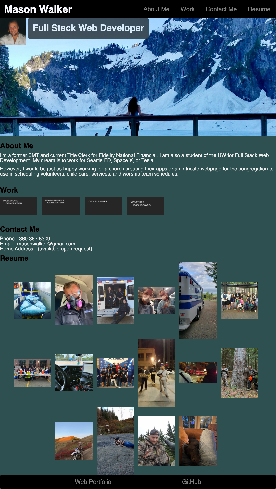

# mW_worx/port

Live Link:

Repo Link:

Goal/Motivation :

        /// To create an online display of all my work created in the UW Web Dev bootcamp to refrer future employers to a visual reprsentation of my created work. 

        /// As well as show pictures of what I look like, my favorite hobbies; and past jobs I have worked along with volunteer work with the homeless in Seattle.

Problem Solved : 

        /// Up until this point I have a word doc resume I have updated, shifted, and edited based on my last 3 jobs along with dates that I would go print onto quality paper to show to new employers when applying for new career prospects. 

        /// With this project, I now have a visual, deployable website that shows who I am, what I have created as a new web dev, and soon it will be ineteractable after we learn more fundementals of Javascript. 

The Standouts:

        /// To me what stands out is my overload of pictures. It shows what is or has been important to me past and present. This puts an image in the mind of the vistor when the page deploys. 

Challenges Faced:

        /// The hero, the bain of my existance and created all formatting issues which is in turn why this page is late for deployment. But also my favorite part of the whole page is the hero I chose. My favorite hiking trip with the most beautiful woman in the world. 

        /// Creating boxes, at this time I need to go review the creation of boxes. I want to go for it and try but its time to move on and come back later. 

